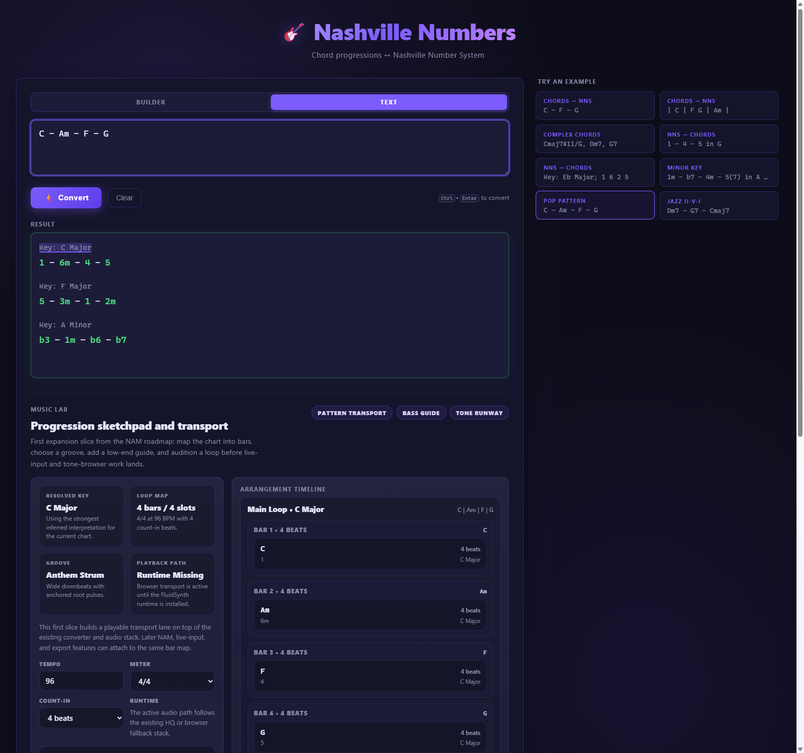

# Nashville Numbers Converter

> **The fastest way to speak Music's secret language.**


Talk to musicians the way musicians actually talk — in numbers. Throw in a chord progression, get back Nashville Numbers. Got a chart full of numbers and need real chords? Done. Works from the command line or a slick native-window/browser GUI, with zero setup beyond a single `pip install`.

---

## Documentation

- [ROADMAP.md](ROADMAP.md)
- [AGENTS.md](AGENTS.md)
- [CLAUDE.md](CLAUDE.md)

---

## Install

```bash
# from an activated .venv
pip install -e .
```

### Optional HQ audio dependencies

```bash
pip install -e ".[audio]"
```

The GUI includes:

- a Windows runtime bootstrap that can install a portable official `FluidSynth` build under `~/.nashville_numbers/runtime/fluidsynth`
- a first-run installer for the free default SoundFont pack (`FluidR3_GM`)
- automatic browser tone fallback when HQ audio is unavailable

---

## GUI — point, click, play

```bash
nns-gui
```

Starts the local HTTP app and opens a native `pywebview` window when available. If the desktop window cannot start, it falls back to your default browser. No Electron, no npm.

### Music Lab transport

The GUI now includes a first-pass arrangement surface built from [`NAM_MUSIC_EXPANSION_IDEA.md`](NAM_MUSIC_EXPANSION_IDEA.md):

- progression planning into bars and slots
- groove presets for different playback feels
- bass-guide layer toggles
- transport playback that uses the existing HQ audio backend when available and falls back to browser audio otherwise
- a timeline that stays linked to fretboard and chord preview interactions



---

## CLI — fast and no-nonsense

```bash
nns-convert "C - F - G"
```

### Chords → Nashville Numbers

```bash
nns-convert "C - F - G"
nns-convert "| C | F G | Am |"
nns-convert "Cmaj7#11/G, Dm7, G7"
```

### Nashville Numbers → Chords (key required)

```bash
nns-convert "1 - 4 - 5 in G"
nns-convert "Key: Eb Major; 1 6 2 5"
nns-convert "1m - b7 - 4m - 5(7) in A minor"
```

Forget the key? You'll hear about it:

```text
Key: REQUIRED
```

---

## Running tests

```bash
python -m pytest -q
```
