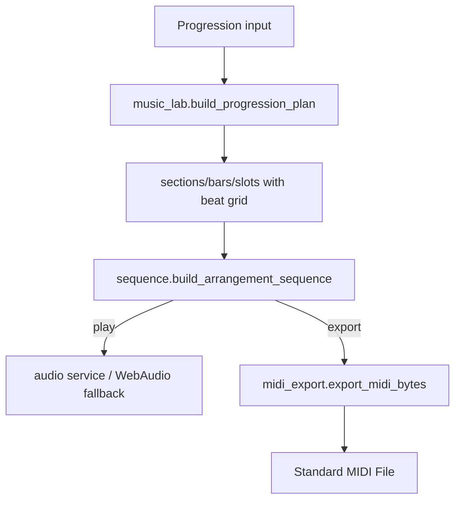

# Music-Theory Deep Research and Audit Specification for dmedlin87/nashville-numbers

## Executive summary

This report audits the **music-theory surface area** of the `dmedlin87/nashville-numbers` repository at commit `5ea14b4e0246c265a60174c3482d596eb3108e5b` (authored March 5, 2026), and builds a **repository-auditing theory model** suitable for AI ingestion. The repository implements a Nashville Number System (NNS) converter (chords ↔ numbers), plus a “Music Lab” planner that turns progressions into timed events (chords, bass, drums) and can export a Standard MIDI File. The implementation is strongest in: chord-symbol parsing/tokenization, diatonic degree mapping for **major** and **natural-minor** contexts, chord voicing generation (including drop-2/drop-3 and basic voice-leading), and MIDI event scheduling. It is weakest or intentionally out-of-scope in: explicit tonal-function reasoning (tonic/predominant/dominant labeling), cadence detection, robust modal support beyond major/minor, chord-scale recommendations, and reharmonization/substitution inference.

A few high-risk discrepancy patterns emerge:

- **Mode support mismatch**: the UI exposes mode names (e.g., Dorian, Mixolydian) and “diatonic lock” chord-quality hints, but the backend parsing largely collapses modes into “Major” vs “Minor”, meaning modal harmony is **not actually implemented** as a distinct pitch-class system. citeturn10search4turn11search4turn10search1  
- **Meter semantics mismatch**: the UI offers “6/8” and “5/4”, but the backend’s MIDI time-signature meta-event defaults to a quarter-note denominator unless explicitly overridden, which risks encoding “6/4” when “6/8” was intended. citeturn8search4turn9search5  
- **Two independent chord engines**: Python (`voicing.py`) supports extended structures (6/9/11/13/add, dim7, mMaj7 corrections), while the GUI’s JavaScript chord-note logic is simplified; this can cause **preview vs playback** disagreements for extensions/alterations. citeturn10search1turn11search1  

The rest of this report delivers:

- A repository file inventory and behavior summary (including tests).
- A rigorous music-theory reference model aligned to the app’s functionality.
- A machine-readable YAML + JSON auditing document mapping each concept to rules, examples, edge cases, and test vectors.
- A discrepancy risk register with severity and remediation.
- A concrete test-suite specification (unit + integration).
- A paste-ready autonomous-agent prompt to audit, critique, and propose patches.

## Repository music-related file inventory and current behavior

### Code paths and responsibilities

| File path | Music-theory concepts touched | Observed behavior (current) | Potential issues to audit |
|---|---|---|---|
| `src/nashville_numbers/parser.py` | chord-symbol tokenization, NNS tokenization, key declaration parsing, mode inference | Splits progression text into tokens (chords vs NNS vs separators), extracts `in <key>` / `key:` clauses, infers conversion direction by counting chord-vs-number hits | “Mode” keywords collapse to Major/Minor buckets; ambiguous parsing around “in” inside progression text; NNS grammar may exclude common NNS conventions (e.g., minor as “-”) |
| `src/nashville_numbers/converter.py` | transposition-by-degree, enharmonic spelling policy, slash-chord mapping, lead-sheet retention | Converts chord roots to degrees (and back) using major/minor scale-degree mappings; retains chord “quality text” largely via parentheses in NNS output; preserves separators | Extended/altered chord parsing is heuristic; non-diatonic functional interpretation is not represented; enharmonic spelling rules are heuristic and may disagree with notation preferences |
| `src/nashville_numbers/key_inference.py` | key-finding, relative major/minor ambiguity, section-level modulation (heuristic) | Scores candidate keys from chord roots; returns top keys; can split sections (based on `|`) when score margin suggests a key switch | No cadence detection; may mis-handle modal harmony; may mis-handle borrowed chords/secondary dominants as “wrong key” noise |
| `src/nashville_numbers/voicing.py` | chord construction, extensions, inversions via slash bass, voice leading, drop-2/drop-3, MIDI pitch mapping | Computes pitch classes for many chord adjectives (maj/min/dim/aug/sus, 7th, 6/9/11/13, add chords) and returns ascending MIDI notes; optional voice leading reduces movement | Still not a full chord-symbol grammar (e.g., “C7alt”, “C13#11b9”); complex alterations may not be represented; chord spelling vs pitch-class equivalence needs tests |
| `src/nashville_numbers/music_lab.py` | harmonic rhythm (bar/slot durations), structural parsing | Builds an arrangement plan: sections→bars→slots, assigns beat durations, picks groove patterns, resolves key | Bar parsing rules may be underspecified for real lead sheets; interaction of meter (6/8, swing) may be ambiguous |
| `src/nashville_numbers/sequence.py` | rhythmic scheduling, groove patterns, bassline generation, “voice leading” in playback | Turns plan into a flat event list (note/chord events), supports strumming, arpeggio patterns, bass patterns (including “walking”), swing/humanize/velocity variance | Beat definition assumes tempo relates to quarter-note; swing model is fixed to off-beat eighth timing; meter meaning may diverge from MIDI export |
| `src/nashville_numbers/midi_export.py` | Standard MIDI File encoding, tempo/meter meta events, pitch-to-event mapping | Writes SMF Type 1 with tempo track + stems (chords/bass/count-in/drums); uses 480 ticks/beat | Time-signature denominator is implicit unless implemented elsewhere; needs explicit audit for 6/8 correctness; SMF compliance depends on event ordering and meta events citeturn8search4turn8search7 |
| `src/nashville_numbers/gui.py` | chord building UI, mode UX, simplified chord-note logic, fretboard mapping | Embedded HTML/JS app: builder mode (NNS→chords and chords→NNS), fretboard visualization, local WebAudio fallback, Music Lab transport | JS chord-note generation is simplified relative to Python; mode UI may overpromise compared to backend; meter UX includes “6/8” but backend may treat as “6 beats” not “compound meter” citeturn14search4turn11search4 |
| `src/nashville_numbers/gui_http.py` | API validation for tempo/meter/voicing | Validates payloads and dispatches to converter, planner, MIDI export, audio service | Validation ranges exist; musical semantics not validated (e.g., 6/8 vs 6/4) |
| `tests/test_parser.py` | parsing correctness | Verifies tokenization, mode detection, key extraction rules | Needs more coverage for common NNS variants (minor dash, augmented markers “+”, diminished “°”, slash-degree edge cases) |
| `tests/test_conversion_golden.py` | conversion semantics | Golden outputs for multi-key inference, explicit key behavior, slash chord mapping, determinism | Needs tests for enharmonic keys (Cb/F#/Gb), non-diatonic tokens, and mode claims |
| `tests/test_key_inference.py` | key inference, modulation splitting | Verifies scoring preference, relative major/minor utilities, heuristic section split | Lacks tests for borrowed chords and secondary dominants; lacks cadence-aware checks (likely out-of-scope, but must be explicit) citeturn9search2turn10search0 |
| `tests/test_voicing.py` | chord construction, voicing styles, voice leading | Strong coverage for chord qualities including dim7 correction, mMaj7, 6/9/11/13/add; drop-2/drop-3; voice-leading determinism | Needs tests for altered dominants (#9/b9/#11/b13), “no3/no5” subtractive degrees (MusicXML-like), and slash inversions in extended chords citeturn9search5turn10search1 |
| `tests/test_sequence.py` | groove scheduling, harmonic rhythm mapping, expression | Validates count-in, chord/bass event counts, timing, multi-hit patterns, swing/humanize, arpeggio, walking bass | Needs tests for compound meter expectations and for correctness of drum mapping vs GM conventions if claimed citeturn17search0turn14search4 |
| `tests/test_midi_export.py` | SMF correctness | Validates header, track counts, program change, time-signature meta presence | Needs tests for denominator correctness (6/8 vs 6/4), and for SMF edge compliance (delta ordering, note-off semantics) citeturn8search4turn8search7 |

### Workflow diagrams (current architecture)

```mermaid
flowchart TD
  A[User progression text] --> B[parser.parse_input]
  B --> C{Mode?}
  C -->|chords_to_nns| D[key_inference.rank_keys / infer_sections]
  C -->|nns_to_chords| E[explicit key required or error]
  D --> F[converter: chord->degree mapping]
  E --> G[converter: degree->chord mapping]
  F --> H[formatted text output]
  G --> H
  H --> I[GUI highlighting + fretboard preview (JS)]
```



## Music theory reference model for this codebase

This section defines the theory concepts the app either implements directly or must treat consistently to avoid user-visible “wrong notes” errors. When the codebase does not specify behavior, the concept is marked **unspecified** in the AI-ingestible spec.

### Pitch representation, tuning, and enharmonics

The repository largely uses **pitch class (0–11)** arithmetic consistent with 12-tone equal temperament (12-TET) for transposition and chord construction. Equal temperament divides the octave into 12 equal semitones; the frequency ratio between adjacent semitones is the 12th root of 2. citeturn11search0  

Enharmonic equivalence (e.g., F♯ vs G♭) is a **spelling distinction** that collapses in equal temperament but matters in notation and key signature conventions. citeturn16search5turn16search0  

For MIDI, note numbers are 0–127; “middle C” is commonly treated as note 60 though octave labeling can vary across instruments and libraries. citeturn16search1turn16search2  

### Tonal harmony and diatonic chord inventory

For auditing conversion correctness, the minimal theory backbone is: **scale degrees**, **diatonic chord qualities**, and **major/minor collections**.

Diatonic triads in major are: I, ii, iii, IV, V, vi, vii° with qualities (major, minor, minor, major, major, minor, diminished). Diatonic triads in minor differ (and minor keys also interact with harmonic/melodic minor variants in practice). citeturn10search1turn10search4  

Because the repo’s core converter uses major and minor mappings, it must consistently handle the minor-key reality that “minor” is not a single scale form historically; the natural minor underlies key signatures, while harmonic/melodic minor introduce raised 7 (and sometimes 6) in common-practice contexts. citeturn10search4  

### Chromatic harmony: modal mixture and applied dominants

Two high-impact chromatic systems matter for real-world chord charts:

- **Modal mixture / modal borrowing**: borrowing chords from the parallel major/minor (or broader modal interchange, depending on definition). citeturn8search0turn8search2turn8search49  
- **Applied (secondary) dominants / tonicization**: borrowing dominant-function chords from a temporary key to emphasize a diatonic chord (e.g., V/V). citeturn9search2turn9search6  

The repo does not appear to explicitly label borrowed chords as “borrowed” or “applied”; instead, it encodes non-diatonicism through accidentals in NNS degrees (e.g., ♭6, ♯4) and through raw chord suffix retention. That is acceptable if explicitly scoped, but it creates predictable discrepancy risks in key inference and in “correct” enharmonic spelling decisions.

### Chord-scale theory, substitutions, and reharmonization

Chord-scale theory maps chords (especially seventh chords) to recommended scales/modes for improvisation—classically taught via ii–V–I relationships (Dorian over ii–7, Mixolydian over V7, Ionian over Imaj7 as a starting point). citeturn11search4turn10search1  

Chord substitutions (including tritone substitution for dominants) and jazz reharmonization techniques are not directly implemented in the repo, but are relevant as **test inputs** and as potential future features. Tritone substitutions replace a V7 with another dominant 7 a tritone away, preserving the core tritone tendency. citeturn12search1  

### Rhythm, meter, and harmonic rhythm for the Music Lab

Harmonic rhythm is the rate at which chords change relative to the beat/meter. It is a distinct layer from surface rhythmic activity. citeturn14search3turn14search4turn14search46  

For MIDI generation, the Standard MIDI File format uses a time-signature meta event (`FF 58 04`) that encodes numerator and denominator as a power of two; correctness matters if the UI claims “6/8” vs “6/4”. citeturn8search4turn8search7  

### Visual aids for auditing spelling and degree logic

image_group{"layout":"carousel","aspect_ratio":"1:1","query":["circle of fifths key signatures diagram","Nashville Number System chart example handwritten","drop 2 chord voicing diagram guitar"],"num_per_query":1}

## AI-ingestible specification document

The following is a **single schema** expressed in **YAML** and **JSON**. The YAML is meant to be human-readable; the JSON is a machine-first mirror (same keys, same semantics). When repo behavior is unclear, fields are explicitly marked `unspecified: true`.

### YAML representation

```yaml
meta:
  document_id: "nns_theory_audit_spec"
  repo:
    host: "github"
    name: "dmedlin87/nashville-numbers"
    branch: "main"
    audited_commit_sha: "5ea14b4e0246c265a60174c3482d596eb3108e5b"
    audited_commit_date_local: "2026-03-05T15:33:20-06:00"
  generated_at_local: "2026-03-08T00:00:00-06:00"
  scope:
    summary: >
      Nashville Number System conversion (chords ↔ numbers) plus progression planning,
      chord voicing, event sequencing, and MIDI export.
    constraints:
      - "If app-specific behavior is not specified, mark as unspecified."
      - "Do not assume user preferences for key signatures or sharp/flat spelling."
      - "Support both sharp/flat spellings and common NNS conventions."
  authoritative_sources_priority:
    - "repo_files_first"
    - "Open Music Theory (open textbook)"
    - "Official standards/specs (MIDI/SMF, MusicXML)"
    - "Encyclopaedia Britannica / academic references"

repo_inventory:
  music_related_paths:
    - path: "src/nashville_numbers/parser.py"
      role: "Tokenization and key-clause parsing; chooses conversion direction"
      concepts: ["notation.tokenization", "notation.key_clause", "notation.mode_keywords"]
      potential_issues: ["mode_collapsing", "nns_grammar_excludes_minor_dash", "ambiguous_in_keyword"]
    - path: "src/nashville_numbers/converter.py"
      role: "Chord↔degree conversion; separator preservation; spelling heuristics"
      concepts: ["nns.mapping", "transposition.degree_to_pitch", "notation.slash_chords", "enharmonic.spelling_policy"]
      potential_issues: ["limited_modes", "suffix_parsing_heuristics", "enharmonic_preference_heuristics"]
    - path: "src/nashville_numbers/key_inference.py"
      role: "Heuristic key ranking and section splitting"
      concepts: ["key_inference", "modulation.section_split_heuristic"]
      potential_issues: ["borrowed_chords_penalized", "no_cadence_detection", "mode_inputs_misranked"]
    - path: "src/nashville_numbers/voicing.py"
      role: "Chord pitch-class construction and MIDI voicings; voice leading; drop2/drop3"
      concepts: ["chords.quality", "chords.extensions", "voicing.styles", "voice_leading", "midi.pitch_mapping"]
      potential_issues: ["no_full_alteration_grammar", "edge_chord_symbols_unparsed"]
    - path: "src/nashville_numbers/music_lab.py"
      role: "Plan builder for bars/slots; groove selection; key resolution integration"
      concepts: ["harmonic_rhythm", "meter.beat_grid", "structure.bars_slots"]
      potential_issues: ["meter_semantics_ambiguous", "bar_parsing_underspecified"]
    - path: "src/nashville_numbers/sequence.py"
      role: "Plan→event list scheduling with swing/humanize; bass/drum patterns"
      concepts: ["rhythm.event_scheduling", "basslines.patterns", "swing.humanize", "voicing.integration"]
      potential_issues: ["compound_meter_not_modeled", "swing_model_fixed"]
    - path: "src/nashville_numbers/midi_export.py"
      role: "Standard MIDI File Type 1 exporter"
      concepts: ["midi.smf", "midi.time_signature_meta", "midi.tempo_meta"]
      potential_issues: ["6_8_denominator", "smf_edge_cases"]
    - path: "src/nashville_numbers/gui.py"
      role: "Embedded UI (builder/fretboard/music-lab); JS chord-note logic"
      concepts: ["ux.builder_modes", "fretboard.scale_degrees", "preview.chord_engine_js"]
      potential_issues: ["js_python_theory_divergence", "mode_ui_overpromises"]
    - path: "tests/test_parser.py"
      role: "Parser unit tests"
      concepts: ["tests.parser"]
      potential_issues: ["missing_nns_variant_tests"]
    - path: "tests/test_conversion_golden.py"
      role: "Golden conversion tests"
      concepts: ["tests.converter"]
      potential_issues: ["missing_enharmonic_key_tests", "missing_modal_inputs_tests"]
    - path: "tests/test_voicing.py"
      role: "Chord construction and voicing tests"
      concepts: ["tests.voicing"]
      potential_issues: ["missing_altered_dominants", "missing_no3_no5"]
    - path: "tests/test_sequence.py"
      role: "Event scheduling tests"
      concepts: ["tests.sequence"]
      potential_issues: ["meter_denominator_gap"]
    - path: "tests/test_midi_export.py"
      role: "MIDI export tests"
      concepts: ["tests.midi"]
      potential_issues: ["time_signature_denominator_gap"]

concepts:
  notation.tokenization:
    definition: "Split progression text into semantic units: chords, NNS tokens, separators, and other text."
    formal_rules:
      - "A token is NNS if it matches: optional accidental (#|b), degree 1–7, optional quality marker, optional parentheses payload, optional slash-degree."
      - "A token is a chord if it begins with letter A–G plus optional accidental (#|b), followed by chord-descriptor text, optional slash bass note."
      - "Separators preserve punctuation and whitespace exactly."
    examples:
      - input: "C,Am - Bb | D"
        output_tokens:
          - ["C","chord"]
          - [",","separator"]
          - ["Am","chord"]
          - [" - ","separator"]
          - ["Bb","chord"]
          - [" | ","separator"]
          - ["D","chord"]
    edge_cases:
      - "Tabs/newlines count as separators and must be preserved."
      - "Strings resembling degrees inside words should be 'other' not NNS."
    test_cases:
      - name: "tokenize_whitespace"
        input: "1\t4\n5\r6"
        expected: [["1","nns"],["\t","separator"],["4","nns"],["\n","separator"],["5","nns"],["\r","separator"],["6","nns"]]
    sources:
      - "Repo: tests/test_parser.py"
      - "Repo: src/nashville_numbers/parser.py"

  notation.key_clause:
    definition: "Extraction of an explicit key context from input text (e.g., 'in G', 'Key: Eb Major')."
    formal_rules:
      - "Recognize prefix and suffix key clauses; support semicolon and newline key clauses."
      - "Key tonic must be A–G with optional #/b."
      - "Key mode is treated as a two-bucket system: Major vs Minor; other mode words may be mapped/treated as Major in backend."
    examples:
      - input: "1 - 4 - 5 in G"
        expected_key: {tonic: "G", mode_bucket: "Major"}
      - input: "Key: Eb Major; 1 6 2 5"
        expected_key: {tonic: "Eb", mode_bucket: "Major"}
    edge_cases:
      - "Non-terminal 'in <X>' inside progression should not be treated as key clause."
      - "If no key is present and input mode is NNS→chords, output should require key."
    test_cases:
      - name: "nns_missing_key"
        input: "1 - 4 - 5"
        expected_output: "Key: REQUIRED"
    sources:
      - "Repo: tests/test_parser.py"
      - "Repo: tests/test_conversion_golden.py"

  nns.mapping:
    definition: >
      Map between pitch-based chord roots and Nashville scale-degree numbers,
      including chromatic alterations (b/#) and optional minor marker.
    formal_rules:
      - "Degrees 1–7 refer to scale degrees in the current key."
      - "Chromatic degrees are expressed by altering the scale degree with b/# (e.g., b3, #4)."
      - "Minor in this repo’s NNS is represented as 'm' suffix (e.g., 6m), not dash; dash should be treated as a compatibility variant (recommended)."
    algorithms:
      - id: "degree_to_pitchclass_major_minor"
        steps:
          - "Represent tonic pitch class as pc(tonic)."
          - "Use mapping tables for Major and Natural Minor offsets (0–11)."
          - "Apply leading accidental b/# to shift by -1/+1 semitone."
          - "Return (tonic_pc + offset + accidental_shift) mod 12."
      - id: "pitchclass_to_degree"
        steps:
          - "Compute interval = (root_pc - tonic_pc + 12) mod 12."
          - "Find closest/diatonic degree match; if not diatonic, represent as b/# degree using canonical mapping."
    examples:
      - key: "C Major"
        mapping_examples:
          - {degree: "1", chord_root: "C"}
          - {degree: "6m", chord_root: "A"}
          - {degree: "b3", chord_root: "Eb"}
          - {degree: "#4", chord_root: "F#"}
    edge_cases:
      - "Enharmonic spellings should respect the key’s flat/sharp preference but must be configurable/unspecified if not exposed."
      - "In minor keys, mixture of natural/harmonic/melodic minor degrees is musically real; backend currently uses a simplified minor bucket."
    test_cases:
      - name: "slash_degree_to_slash_note"
        input: "1/3 in C"
        expected_output: "C/E"
    sources:
      - "Repo: src/nashville_numbers/converter.py"
      - "Repo: src/nashville_numbers/voicing.py"
      - "Open Music Theory: diatonic chords and lead-sheet symbols (triads/sevenths)"

  chords.quality_and_extensions:
    definition: >
      Chord-symbol components: root, triad quality (maj/min/dim/aug/sus),
      seventh quality, and extensions/additions (6, 9, 11, 13, add9, etc.).
    formal_rules:
      - "Triad quality determined by 3rd and 5th above root."
      - "Seventh chords add 7th above root; dominant vs major/minor seventh depends on 7th quality."
      - "Extensions add upper chord members (9, 11, 13) typically built atop a seventh chord; addX adds without implied 7th."
    algorithms:
      - id: "pitchclass_sets_from_symbol_subset"
        steps:
          - "Parse root note → root_pc."
          - "Determine third: maj=+4, min/dim=+3, sus2=+2, sus4=+5."
          - "Determine fifth: perfect=+7, dim/b5=+6, aug/#5=+8."
          - "Determine seventh: maj7=+11, dom/min7=+10, dim7=+9."
          - "Add extensions: 9=+2, 11=+5, 13=+9 (mod 12), with policy on whether 7th is implied."
    examples:
      - {symbol: "C", pcs: [0,4,7]}
      - {symbol: "G7", pcs: [7,11,2,5]}
      - {symbol: "Bdim7", pcs: [11,2,5,8]}
      - {symbol: "Cadd9", pcs: [0,4,7,2]}
    edge_cases:
      - "Altered dominants (e.g., 7b9#11) require a degree-alter grammar (recommended; currently partial)."
      - "Symbols like 'Cmmaj7' are supported in Python voicing; ensure consistent casing and parsing."
    test_cases:
      - name: "dim7_correct_interval"
        input: {chord: "Bdim7", key: "C Major"}
        expected_pitch_classes: [11,2,5,8]
    sources:
      - "Repo: tests/test_voicing.py"
      - "Open Music Theory: triads and seventh chords"
      - "MusicXML chord symbol tutorial (for add/alter/subtract degree model)"

  notation.slash_chords_inversions:
    definition: "Slash chords indicate a non-root bass note, encoding inversion or specific bass motion (e.g., C/E)."
    formal_rules:
      - "Chord symbol 'Root/...Bass' sets bass pitch class explicitly."
      - "NNS slash '1/3' indicates chord with bass scale degree 3 in the current key."
    examples:
      - {symbol: "C/E", meaning: "C major triad with E in bass"}
      - {symbol: "1/3 in C", realized: "C/E"}
    edge_cases:
      - "Slash bass outside chord tones (e.g., C/D) should be allowed as a bass pedal convention (unspecified in repo)."
    test_cases:
      - name: "chord_to_nns_slash_mapping"
        input: "C/E - G/B - Am/C"
        expected_contains: ["1/3", "5/7", "6m/1"]
    sources:
      - "Repo: tests/test_conversion_golden.py"
      - "Open Music Theory: inversion definitions"

  voice_leading:
    definition: "Rules for choosing chord inversions/registrations to minimize total voice motion between consecutive chords."
    formal_rules:
      - "Prefer common tones; prefer stepwise motion; avoid large leaps when alternatives exist."
      - "In algorithmic voicing, treat prior chord MIDI set as target; choose octave placements minimizing sum(|delta|)."
    examples:
      - progression: "C -> F"
        expected: "Voice-led F inversion has lower movement cost than root-position F."
    edge_cases:
      - "Voice-leading should remain deterministic for identical inputs (important for testing)."
    test_cases:
      - name: "voice_leading_deterministic"
        input: {prev: "C", next: "G", key: "C Major"}
        expected: "same MIDI output every run"
    sources:
      - "Repo: tests/test_voicing.py"
      - "Open Music Theory: inversion and voice-leading basics"

  voicing.styles:
    definition: "Chord voicing transformations such as close position, drop-2, and drop-3."
    formal_rules:
      - "Close: stacked ascending chord tones in a chosen register."
      - "Drop-2: lower the second-highest note by an octave (triads treated as drop the middle note)."
      - "Drop-3: lower the third-highest note by an octave (requires ≥4 notes)."
    examples:
      - chord: "Cmaj7"
        close: [48,52,55,59]
        drop2: [43,48,52,59]
        drop3: [40,48,55,59]
    edge_cases:
      - "If chord has <4 tones, drop-3 is a no-op."
    test_cases:
      - name: "drop3_triad_no_change"
        input: {chord: "C", style: "drop3"}
        expected_midi: [48,52,55]
    sources:
      - "Repo: tests/test_voicing.py"

  harmonic_rhythm_and_bars:
    definition: "Mapping of a chord progression into bars and beat durations, defining where and how long each chord lasts."
    formal_rules:
      - "Bar separators ('|') define explicit bar boundaries."
      - "If no bars, planner may treat each chord as a full bar (repo behavior)."
    examples:
      - input: "| C G | Am F |"
        expected: "2 bars; each bar has 2 slots of 2 beats in 4/4"
    edge_cases:
      - "Compound meter (6/8) requires a beat definition policy (unspecified): dotted-quarter beats vs eighth-note beats."
    test_cases:
      - name: "subdivided_bar_timing_4_4"
        input: "| C G |"
        expected_slot_starts_beats: [0,2]
    sources:
      - "Repo: tests/test_sequence.py"
      - "Music theory: harmonic rhythm definition (context)"

  midi.smf:
    definition: "Standard MIDI File (SMF) container holding tempo, time signature, and note event streams."
    formal_rules:
      - "SMF Type 1: multiple tracks; Track 0 typically contains tempo/time signature meta events."
      - "Time signature meta event encodes denominator as power-of-two."
    examples:
      - "Export plan -> SMF bytes starting with 'MThd' header."
    edge_cases:
      - "6/8 vs 6/4 denominator must be correct if UI promises a specific meter."
    test_cases:
      - name: "time_sig_meta_presence"
        input: {meter: 4}
        expected_bytes_contains_hex: "FF 58 04"
    sources:
      - "Repo: tests/test_midi_export.py"
      - "Library of Congress SMF format description"
      - "MIDI.org SMF spec (access controlled)"

discrepancy_risk_register:
  - id: "mode_ui_backend_mismatch"
    severity: "critical"
    likely_symptoms:
      - "User selects Dorian/Mixolydian; output behaves like plain minor/major."
      - "Diatonic builder hints do not match conversion results."
    remediation:
      - "Either: implement true mode pitch collections in backend; or: remove/rename mode UI to avoid implying support."
      - "Add explicit docs: 'Modes are approximated as major/minor buckets' if kept."
  - id: "meter_denominator_midi_export"
    severity: "high"
    likely_symptoms:
      - "Exported MIDI encodes 6/4 when user expects 6/8."
    remediation:
      - "Change plan schema to include denominator (or denominator_power) and pass to MIDI exporter."
      - "Update UI to capture denominator explicitly."
  - id: "js_vs_python_chord_engines"
    severity: "high"
    likely_symptoms:
      - "Chord preview (WebAudio) disagrees with arrangement playback (backend) for extensions/alterations."
    remediation:
      - "Expose a backend endpoint 'chord->midis' that uses voicing.py and use it for GUI preview."
      - "Or port voicing logic to shared library used by both Python and JS."

test_suite_spec_outline:
  unit_tests:
    - module: "parser"
      focus: ["dash_minor_variant", "double_accidentals_unspecified", "ambiguous_in_keyword"]
    - module: "converter"
      focus: ["enharmonic_keys", "borrowed_chords_accidentals", "slash_degree_bass_spelling"]
    - module: "voicing"
      focus: ["altered_dominants", "no3_no5", "extended_slash_chords"]
    - module: "midi_export"
      focus: ["6_8_time_signature_denominator_power", "track_count_invariants"]
  integration_tests:
    - name: "convert_then_plan_then_export"
      steps:
        - "convert input"
        - "plan arrangement"
        - "export midi"
      invariants:
        - "deterministic output given fixed seed"
        - "event timing monotonic"
        - "MThd header valid"

authoritative_source_links:
  open_music_theory:
    - "https://openmusictheory.github.io/triads.html"
    - "https://viva.pressbooks.pub/openmusictheory/chapter/minor-scales/"
    - "https://viva.pressbooks.pub/openmusictheory/chapter/modal-mixture/"
    - "https://viva.pressbooks.pub/openmusictheorycopy/chapter/applied-chords/"
    - "https://openmusictheory.github.io/Modulation.html"
    - "https://viva.pressbooks.pub/openmusictheorycopy/chapter/chord-scale-theory/"
    - "https://viva.pressbooks.pub/openmusictheory/chapter/substitutions/"
    - "https://viva.pressbooks.pub/openmusictheory/chapter/inversion-and-figured-bass/"
    - "https://viva.pressbooks.pub/openmusictheory/part/rhythm-and-meter/"
  musicxml:
    - "https://www.w3.org/2021/06/musicxml40/tutorial/chord-symbols-and-diagrams/"
    - "https://w3c.github.io/musicxml/musicxml-reference/elements/kind/"
  midi_and_smf:
    - "https://www.loc.gov/preservation/digital/formats/fdd/fdd000119.shtml"
    - "https://midi.org/standard-midi-files-specification"
  britannica:
    - "https://www.britannica.com/art/equal-temperament"
    - "https://www.britannica.com/art/enharmonic"
```

### JSON representation

```json
{
  "meta": {
    "document_id": "nns_theory_audit_spec",
    "repo": {
      "host": "github",
      "name": "dmedlin87/nashville-numbers",
      "branch": "main",
      "audited_commit_sha": "5ea14b4e0246c265a60174c3482d596eb3108e5b",
      "audited_commit_date_local": "2026-03-05T15:33:20-06:00"
    },
    "generated_at_local": "2026-03-08T00:00:00-06:00",
    "scope": {
      "summary": "Nashville Number System conversion (chords ↔ numbers) plus progression planning, chord voicing, event sequencing, and MIDI export.",
      "constraints": [
        "If app-specific behavior is not specified, mark as unspecified.",
        "Do not assume user preferences for key signatures or sharp/flat spelling.",
        "Support both sharp/flat spellings and common NNS conventions."
      ]
    },
    "authoritative_sources_priority": [
      "repo_files_first",
      "Open Music Theory (open textbook)",
      "Official standards/specs (MIDI/SMF, MusicXML)",
      "Encyclopaedia Britannica / academic references"
    ]
  },
  "repo_inventory": {
    "music_related_paths": [
      {
        "path": "src/nashville_numbers/parser.py",
        "role": "Tokenization and key-clause parsing; chooses conversion direction",
        "concepts": ["notation.tokenization", "notation.key_clause", "notation.mode_keywords"],
        "potential_issues": ["mode_collapsing", "nns_grammar_excludes_minor_dash", "ambiguous_in_keyword"]
      },
      {
        "path": "src/nashville_numbers/converter.py",
        "role": "Chord↔degree conversion; separator preservation; spelling heuristics",
        "concepts": ["nns.mapping", "transposition.degree_to_pitch", "notation.slash_chords", "enharmonic.spelling_policy"],
        "potential_issues": ["limited_modes", "suffix_parsing_heuristics", "enharmonic_preference_heuristics"]
      },
      {
        "path": "src/nashville_numbers/key_inference.py",
        "role": "Heuristic key ranking and section splitting",
        "concepts": ["key_inference", "modulation.section_split_heuristic"],
        "potential_issues": ["borrowed_chords_penalized", "no_cadence_detection", "mode_inputs_misranked"]
      },
      {
        "path": "src/nashville_numbers/voicing.py",
        "role": "Chord pitch-class construction and MIDI voicings; voice leading; drop2/drop3",
        "concepts": ["chords.quality", "chords.extensions", "voicing.styles", "voice_leading", "midi.pitch_mapping"],
        "potential_issues": ["no_full_alteration_grammar", "edge_chord_symbols_unparsed"]
      },
      {
        "path": "src/nashville_numbers/music_lab.py",
        "role": "Plan builder for bars/slots; groove selection; key resolution integration",
        "concepts": ["harmonic_rhythm", "meter.beat_grid", "structure.bars_slots"],
        "potential_issues": ["meter_semantics_ambiguous", "bar_parsing_underspecified"]
      },
      {
        "path": "src/nashville_numbers/sequence.py",
        "role": "Plan→event list scheduling with swing/humanize; bass/drum patterns",
        "concepts": ["rhythm.event_scheduling", "basslines.patterns", "swing.humanize", "voicing.integration"],
        "potential_issues": ["compound_meter_not_modeled", "swing_model_fixed"]
      },
      {
        "path": "src/nashville_numbers/midi_export.py",
        "role": "Standard MIDI File Type 1 exporter",
        "concepts": ["midi.smf", "midi.time_signature_meta", "midi.tempo_meta"],
        "potential_issues": ["6_8_denominator", "smf_edge_cases"]
      }
    ]
  },
  "concepts": {
    "notation.tokenization": {
      "definition": "Split progression text into semantic units: chords, NNS tokens, separators, and other text.",
      "formal_rules": [
        "A token is NNS if it matches: optional accidental (#|b), degree 1–7, optional quality marker, optional parentheses payload, optional slash-degree.",
        "A token is a chord if it begins with letter A–G plus optional accidental (#|b), followed by chord-descriptor text, optional slash bass note.",
        "Separators preserve punctuation and whitespace exactly."
      ],
      "examples": [
        {
          "input": "C,Am - Bb | D",
          "output_tokens": [
            ["C", "chord"],
            [",", "separator"],
            ["Am", "chord"],
            [" - ", "separator"],
            ["Bb", "chord"],
            [" | ", "separator"],
            ["D", "chord"]
          ]
        }
      ],
      "edge_cases": [
        "Tabs/newlines count as separators and must be preserved.",
        "Strings resembling degrees inside words should be 'other' not NNS."
      ],
      "test_cases": [
        {
          "name": "tokenize_whitespace",
          "input": "1\t4\n5\r6",
          "expected": [
            ["1", "nns"],
            ["\t", "separator"],
            ["4", "nns"],
            ["\n", "separator"],
            ["5", "nns"],
            ["\r", "separator"],
            ["6", "nns"]
          ]
        }
      ],
      "sources": ["Repo: tests/test_parser.py", "Repo: src/nashville_numbers/parser.py"]
    },
    "midi.smf": {
      "definition": "Standard MIDI File (SMF) container holding tempo, time signature, and note event streams.",
      "formal_rules": [
        "SMF Type 1: multiple tracks; Track 0 typically contains tempo/time signature meta events.",
        "Time signature meta event encodes denominator as power-of-two."
      ],
      "edge_cases": ["6/8 vs 6/4 denominator must be correct if UI promises a specific meter."],
      "sources": [
        "Repo: tests/test_midi_export.py",
        "Library of Congress SMF format description",
        "MIDI.org SMF spec (access controlled)"
      ]
    }
  },
  "discrepancy_risk_register": [
    {
      "id": "mode_ui_backend_mismatch",
      "severity": "critical",
      "likely_symptoms": [
        "User selects Dorian/Mixolydian; output behaves like plain minor/major.",
        "Diatonic builder hints do not match conversion results."
      ],
      "remediation": [
        "Either: implement true mode pitch collections in backend; or: remove/rename mode UI to avoid implying support.",
        "Add explicit docs: 'Modes are approximated as major/minor buckets' if kept."
      ]
    }
  ]
}
```

## Discrepancy risk register and remediation

### Highest-probability theory ↔ implementation mismatches

| Severity | Discrepancy | Why it’s likely | What “wrong” looks like | Remediation (practical) |
|---|---|---|---|---|
| Critical | Mode UI vs backend mode model | Backend treats most mode words as Major/Minor buckets; theory expects distinct pitch collections for Dorian/Mixolydian/etc. citeturn11search4turn10search4 | Dorian selected but b6/♮6 behavior is wrong; “diatonic lock” suggests chords that don’t match conversion | Either implement true mode pitch mappings in backend, or re-label UI to “Major-family / Minor-family” (and document approximation) |
| High | 6/8 representation vs MIDI time-signature denominator | SMF time signature requires denominator power-of-two; backend defaults denominator to 4 unless explicitly passed. citeturn8search4turn8search7 | Exported MIDI shows/plays as 6/4 grid; DAW notation is misleading; groove feels “off” | Make meter a structured `{numerator, denominator}`; pass denominator to `_time_sig_meta` and adjust “beat” meaning for compound meters |
| High | JS preview chord engine diverges from Python voicing | JS uses simplified chord-note extraction (triad+basic 7), while Python supports 6/9/11/13/add and corrected dim7/mMaj7 | Clicking tokens plays “wrong chord” compared to arrangement playback/export | Add backend endpoint `POST /theory/chord-midies` to compute midis via `voicing.py`, use that for previews; or port voicing logic into a shared module |
| Medium | Non-diatonic chords distort key inference | Key inference is heuristic and will penalize borrowed chords and applied dominants even when musically correct. citeturn9search6turn8search2 | Progressions with secondary dominants infer wrong home key; sections split oddly | Add “secondary dominant suspicion” rule (accidental-raising near diatonic target) or add robust “chromatic tolerance” in scoring |
| Medium | Nashville conventions: minor as dash, diminished as ° | Many NNS charts use `6-` for minor and `°` for diminished; repo NNS grammar uses “m/dim”. | User pastes real Nashville chart → tokenization fails or converts incorrectly | Extend parser/converter to accept `-` and `°/o` variants and normalize internally |
| Low | Enharmonic spelling preference | Repo picks sharps/flats via heuristics; users often have strong preferences for readable spellings in flat keys. citeturn16search5turn16search0 | Output shows F# in Gb contexts or vice versa | Expose `spelling_preference` option; add tests for keys like F#, Gb, Cb |

## Test suite specification with concrete test vectors

This section defines **new tests** to complement the existing suite, using the repo’s established semantics (string outputs for conversions; MIDI bytes invariants for export), and adding vectors that target likely edge failures.

### Unit tests

**Parser and tokenization**

1. **NNS minor dash compatibility**  
   - Input: `6- 4 1 5 in C`  
   - Expected: treated equivalently to `6m 4 1 5 in C` (exact output depends on formatting policy; if normalization is implemented, confirm canonical form).  
   - Rationale: common Nashville chart convention.

2. **Diminished symbol compatibility**  
   - Input: `7° in C` or `7o in C`  
   - Expected: normalized to `7dim` token or equivalent conversion; if unsupported, expected explicit “unsupported token” path (must be specified).

3. **“in” keyword inside progression must not become key clause**  
   - Input: `C in G F`  
   - Expected: mode `chords_to_nns`, no key tonic extracted (matches existing behavior pattern).

**Converter mapping and enharmonic spelling**

4. **Enharmonic key spelling sanity**  
   - Input: `Key: Gb Major; 1 4 5`  
   - Expected chords: `Gb Cb Db` (or a consistent documented alternative), not `F# B E#` unless explicitly chosen. citeturn16search5turn16search0  

5. **Borrowed chord preserved as chromatic degree**  
   - Input: `C - Ab - F - G`  
   - Expected (in C major interpretation): `1 - b6 - 4 - 5` (or equivalent) because A♭ is ♭6 in C. citeturn8search2turn8search49  

6. **Secondary dominant does not force wrong key** (behavioral test)  
   - Input: `C - D7 - G`  
   - Expected: key ranking includes C major high, and `D7` renders as `2(7)` or `V/V`-like encoding depending on scheme; if scheme is “just store suffix”, ensure D is degree 2 and “7” retained. citeturn9search6turn9search2  

**Voicing engine**

7. **Altered dominant partial support**  
   - Input chord: `G7b9` or `G7#9` in key C  
   - Expected: if supported, pitch classes include b9/#9; if unsupported, explicit documented fallback (e.g., treat as G7).  
   - Rationale: these are common in charts; MusicXML’s degree model provides a standard approach. citeturn9search5turn9search4  

8. **Slash chord with extension**  
   - Input chord: `Cmaj9/E`  
   - Expected: bass MIDI corresponds to E; chord MIDI includes 9th tone.

### Integration tests

**Convert → Plan → Sequence determinism**

9. Input: `| C | F G | Am |` with tempo 120, meter 4, groove “pads”, voice_leading true, expression_seed fixed  
   - Expected invariants:
     - Deterministic plan structure and deterministic event list with same seed.  
     - No negative delays; non-decreasing event delays after sorting; highlights align to slot starts.

**Plan → MIDI export meter correctness**

10. Input: meter selection “6/8” (represented however the app chooses after remediation)  
   - Expected:
     - MIDI time signature meta event denominator_power encodes 8 (power 3), not 4 (power 2). citeturn8search4turn8search7  

## Autonomous-agent audit prompt

"YOU ARE AN AUTONOMOUS REPOSITORY AUDITOR specializing in music-theory correctness and notation/MIDI interoperability. Your mission is to verify, critique, and propose fixes for the GitHub repo `dmedlin87/nashville-numbers` against the provided spec (theory + algorithms + tests).\n\nOPERATING PRINCIPLES\n- Be strict about mismatches between claimed UX and implemented theory.\n- Never assume notation preferences (sharps vs flats); when ambiguous, add configuration or mark behavior as unspecified.\n- Prefer small, test-driven patches.\n- Preserve backward compatibility where possible; when breaking changes are necessary, document and gate behind flags.\n\nREQUIRED CAPABILITIES\n1) Repo bootstrap\n- Commands:\n  - `python -m venv .venv && source .venv/bin/activate` (or Windows equivalent)\n  - `pip install -e .[dev] || pip install -e .` (choose what works)\n  - `pytest -q`\n- Collect: failing tests, warnings, and any nondeterminism.\n\n2) Music-theory auditing\n- Use the following evaluation dimensions:\n  A. Tokenization correctness (chords vs NNS vs separators)\n  B. Key clause parsing correctness (in/key:; semicolon/newline)\n  C. Major/minor diatonic mapping correctness\n  D. Chromatic degree handling (b/# degrees)\n  E. Slash chord mapping correctness\n  F. Extended/altered chord handling correctness\n  G. Voicing and voice-leading determinism\n  H. Meter and timing semantics (especially 6/8 vs 6/4)\n  I. MIDI export compliance (SMF structure + time signature)\n  J. Cross-engine consistency (Python voicing vs JS preview)\n\n3) Concrete deliverables\n- Output:\n  - A prioritized list of issues with severity (critical/high/medium/low)\n  - For each issue: reproduction steps + expected vs actual + root cause + proposed fix\n  - A patch series (git-style diffs) OR clear code blocks showing precise edits\n  - New tests for every fix\n\nEVALUATION METRICS\n- Test pass rate: 100% expected after fixes.\n- Spec coverage: each concept in the YAML ‘concepts’ section must be either (a) tested, (b) explicitly marked unsupported/unspecified in docs.\n- Determinism: repeated runs produce identical outputs for fixed seeds.\n- UX honesty: UI must not imply support for modes/meters not implemented.\n\nAUDIT PLAYBOOK (DO THIS IN ORDER)\n1) Run the existing test suite. Record baseline.\n2) Audit meter semantics:\n  - Trace: GUI meter selection -> music_lab plan -> sequence -> midi_export.\n  - Verify SMF time signature denominator is correct. If UI offers 6/8, then SMF must encode denominator_power=3.\n  - If meter is treated as ‘beats per bar’ only, rename UI labels to avoid fraction notation OR implement denominator.\n  - Add tests: `test_time_signature_6_8_encodes_denominator_power_3`.\n\n3) Audit mode semantics:\n  - Trace: GUI ‘keyQuality’ modes -> builder output string -> parser.parse_input -> converter.\n  - If backend only supports Major/Minor, then:\n    Option A (minimal): rename UI modes to ‘Major-family’ and ‘Minor-family’ and document approximation.\n    Option B (full): implement true mode pitch-offset arrays in converter/voicing and update key inference.\n  - Add tests for Dorian/Mixolydian either as explicit unsupported or fully supported.\n\n4) Audit Nashville notation compatibility:\n  - Add support for minor dash: `6-` meaning `6m`.\n  - Add support for diminished symbol: `°` or `o` meaning `dim`.\n  - Ensure internal canonicalization so output remains stable.\n  - Add parser + converter tests.\n\n5) Audit JS vs Python chord engines:\n  - Identify where JS computes chord MIDI notes for preview and for WebAudio fallback.\n  - Compare against Python voicing for extended chords.\n  - Preferred fix: add a backend endpoint `POST /theory/chord-midies` that returns voicing.py results, and use it in GUI for previews.\n  - Add integration tests: clicking/preview should match backend for representative chords (C13, Bdim7, Cmmaj7, Cadd9).\n\n6) Audit key inference tolerance for chromaticism:\n  - Add test vectors containing modal mixture (e.g., C – Ab – F – G) and secondary dominants (C – D7 – G).\n  - If inference breaks, adjust scoring: do not over-penalize a small number of chromatic chords.\n  - Do NOT implement cadence detection unless explicitly scoped; instead document that modulation is heuristic.\n\nPATCH SNIPPETS (STARTING POINTS)\n- Minor dash normalization suggestion:\n  - In NNS token parsing, transform `r\"(?P<deg>[#b]?[1-7])-(?P<rest>.*)\"` -> `deg + 'm' + rest`.\n- Meter structure suggestion:\n  - Replace single `meter` int with `{numerator:int, denominator:int}` in plan.\n  - Update midi_export `_time_sig_meta(numerator, denominator_power=log2(denominator))`.\n- Preview consistency endpoint suggestion:\n  - Add `POST /theory/chord-midies`:\n    - input: {chord_text, key_tonic, key_mode, voicing_style, voice_leading_prev_midis?}\n    - output: {midis}\n\nREPORTING FORMAT\n- Provide a final markdown report with:\n  - Executive summary\n  - Issue list (prioritized)\n  - Diffs/tests\n  - Notes on any remaining unspecified behavior\n\nNOW EXECUTE THIS AUDIT AUTONOMOUSLY."

## Sources

Repo-derived (primary): repository files and tests listed in the inventory table above (commit `5ea14b4e0246c265a60174c3482d596eb3108e5b`).

External (high priority):

- entity["book","Open Music Theory","open textbook"] on triads/sevenths, minor scales, inversion, modal mixture, applied chords/tonicization, modulation, chord-scale theory, substitutions, and rhythm/meter. citeturn10search1turn10search4turn11search1turn8search2turn9search6turn10search0turn11search4turn12search1turn14search4  
- entity["organization","W3C","web standards body"] MusicXML chord symbol modeling (root/alter, chord kind, and degree add/alter/subtract). citeturn9search5turn9search4  
- entity["organization","Library of Congress","us national library"] format description for Standard MIDI File. citeturn8search4  
- entity["organization","The MIDI Association","midi standards org"] SMF specification availability and MIDI standards context (note: spec download may be access-controlled). citeturn8search7turn8search6  
- entity["organization","Encyclopaedia Britannica","encyclopedia"] on equal temperament, enharmonic equivalence, circle of fifths context, and modulation definitions. citeturn11search0turn16search5turn16search6turn10search2